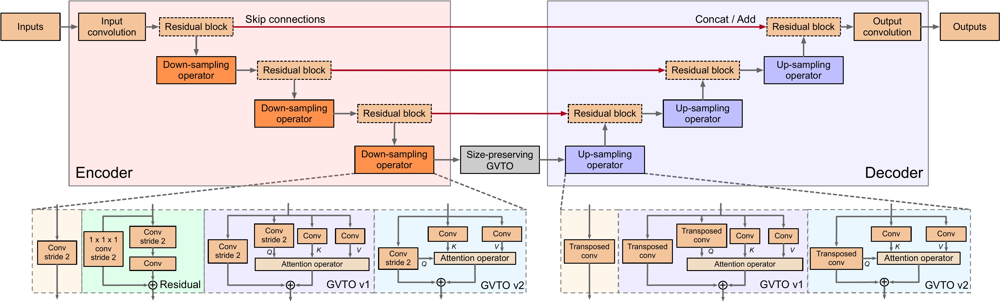
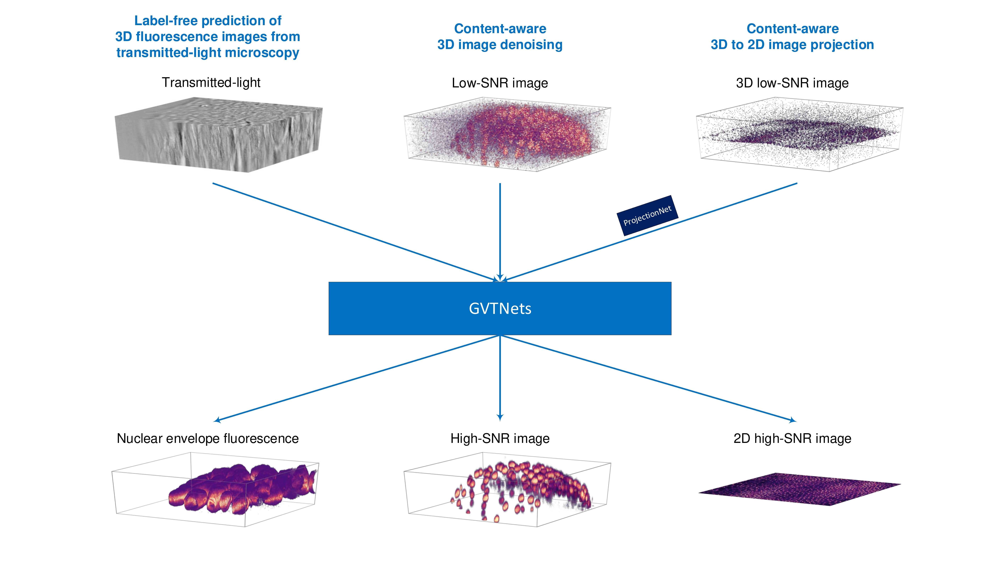

# Global Voxel Transformer Networks: A Deep Learning Tool for Augmented Microscopy

## Global Voxel Transformer Networks (GVTNets)



## Augmented Microscopy Tasks



## System Requirements

We highly recommend using the Linux operating system. Using an nVIDIA GPU with >=11GB memory is highly recommended, although this tool can be used with CPU only.

We used Ubuntu 16.04.6 LTS (GNU/Linux 4.4.0-141-generic x86_64)) and an nVIDIA GeForce RTX 2080 Ti GPU with nVIDIA driver version 430.50 and CUDA version 10.1.

## Installation

### Environment setup

- We highly recommend installing [Anaconda](https://www.anaconda.com/distribution/) for a simple environment setup and installation.
- Download the code:
```
git clone https://github.com/zhengyang-wang/Image2Image.git
cd Image2Image
```
- Create a virtual environment with required packages:
```
conda env create -f gvtnet.yml
```
- Activate the virtual environment:
```
conda activate gvtnet
```
or
```
source activate gvtnet
```
Choose whichever works for you.

## Usage

### Label-free prediction of 3D fluorescence images from transmitted-light microscopy

#### Preparation

- Download [label-free datasets](https://downloads.allencell.org/publication-data/label-free-prediction/index.html).

- Untar all the datasets under one folder. Suppose the folder is `data/`, it should contain 13 datasets named `beta_actin`, `fibrillarin`, etc. In addition, `data/beta_actin/` should contain images only.

- Give execution permission to scripts:
```
chmod +x ./scripts/label-free/*.sh
```

- Change `RAW_DATASET_DIR` in `train.sh`, `train_dic.sh`, `train_membrane.sh` and `predict.sh`, `predict_dic.sh`, `predict_membrane.sh` to your folder that saves all the untarred datasets.

#### Training

- Modify `network_configure.py` according to your design. For users who are not familiar with deep learning, simply copy the content of `network_configures/gvtnet_label-free.py` to `network_configure.py`.

- Train the GVTNets for datasets except `dic_lamin_b1` and `membrane_caax_63x`:
```
./scripts/label-free/train.sh [dataset] [gpu_id] [model_name]
```

- For `dic_lamin_b1` and `membrane_caax_63x`, use `train_dic.sh` and `train_membrane.sh`, respectively:
```
./scripts/label-free/train_dic.sh [gpu_id] [model_name]
./scripts/label-free/train_membrane.sh [gpu_id] [model_name]
```

---

**Example:**

If you want to train a GVTNet called `your-gvtnet` on `beta_actin` using the GPU #1, run:
```
./scripts/label-free/train.sh beta_actin 1 your-gvtnet
```
After training, you will find:
- Transformed datasets are saved under `save_dir/label-free/beta_actin/datasets/`. This process will only be performed for the first run.
- The content in `network_configure.py` is saved as `network_configures/your-gvtnet.py`.
- Model checkpoints are saved under `save_dir/label-free/beta_actin/models/your-gvtnet/`.

**Note**: Always give a different `model_name` when you use a different `network_configure.py`. This tool will used `model_name` to track different network configures.

---

#### Prediction

- Predict the testing set using saved model checkpoints for datasets except `dic_lamin_b1` and `membrane_caax_63x`:
```
./scripts/label-free/predict.sh [dataset] [gpu_id] [model_name] [checkpoint_num]
```

- For `dic_lamin_b1` and `membrane_caax_63x`, use `predict_dic.sh` and `predict_membrane.sh`, respectively:
```
./scripts/label-free/predict_dic.sh [gpu_id] [model_name] [checkpoint_num]
./scripts/label-free/predict_membrane.sh [gpu_id] [model_name] [checkpoint_num]
```

---

**Example:**

If you have trained a GVTNet called `your-gvtnet` on `beta_actin`, and want to make prediction for the testing set with the saved model checkpoints after training for `75,000` minibatch iterations, run:
```
./scripts/label-free/predict.sh beta_actin 1 your-gvtnet 75000
```
After prediction, you will find:
- Prediction results are saved under `save_dir/label-free/beta_actin/results/your-gvtnet/checkpoint_75000/`.

**Note**: If your GPU memory is limited, set `gpu_id` to `-1` for CPU prediction.

---

#### Evaluation

- 

### Content-aware 3D image denoising

### Content-aware 3D to 2D image projection

### To train and inference/test on the *Label-free* Datasets and the *CARE* Datasets

We prepared the pre-written scripts for the training and testing on these datasets.

- To download the datasets
    - **CARE**: [https://publications.mpi-cbg.de/publications-sites/7207/](https://publications.mpi-cbg.de/publications-sites/7207/)
    - **Label-free**: [https://downloads.allencell.org/publication-data/label-free-prediction/index.html](https://downloads.allencell.org/publication-data/label-free-prediction/index.html)
    
    Then extract the compressed files.

#### For CARE Datasets

- To modify and run the training scripts

    1. Modify ``NPZ_DATASET_DIR`` in the training scripts by changing the path to where you put the
    downloaded and extracted training datasets. For **CARE**, there should be the file named ``data_label.npz``
    under the path you specify.
    2. If you want to specify the directory where the trained model will be saved, or the training setting
    , such as the learning rate, you can modify them accordingly in the script file.
    3. Run the scripts using the command
    ```
    scripts/training_script_name.sh
    ```
    
- To modify and run the predicting scripts

    1. Modify ``TIFF_DATASET_DIR`` in the predicting scripts by changing the path to where you put the
    downloaded test images. The path should contain one or more ``.tif/.tiff`` files that you
    want to predict from or test on. The number of such ``.tif/.tiff`` files are specified in
    ``NUM_TEST_PAIRS``. If you change the number of the files or use other test images, you will need to
    specify ``NUM_TEST_PAIRS`` accordingly.
    2. Specify the ``MODEL_DIR`` (if you changed it in training scripts) and the ``CHECKPOINT_NUM``. If
    you would like to use the pre-trained model provided by us, you can modify the ``CHECKPOINT_NUM`` line
    into ``CHECKPOINT_NUM="pretrained"``.
    3. If you want to specify the directory to output the images, or the predict settings such as GPU id, 
    whether to crop the input images (you will need to do so when your GPU does not have enough memory, 
    they will be assembled back as a whole after the prediction), 
    4. Run the scripts using the command
    ```
    scripts/predicting_script_name.sh
    ```

- Run the evaluation scripts
    ```
    scripts/evaluation_script_name.sh
    ```
    
#### For Label-free Datasets


### To train and inference/test with your own datasets.

- To prepare your training dataset: (randomly) crop the training image pairs into two sets of patches and save 
them into npz file(s). The npz file(s) can be either A single npz file containing all training data structured as:

            
      {'X': (n_sample, n_channel, (depth,) height, width),
       'Y': (n_sample, n_channel, (depth,) height, width)}
      
    or Multiple npz files where each one contains one training sample structured as:
      
      {'X': (n_channel, (depth,) height, width),
       'Y': (n_channel, (depth,) height, width)}
      
    If your data contains uncropped images with different sizes, use the later data structure.
       
- To train with the dataset: 

      python train.py [--args]
      
     You will need to specify the arguments, such as npz_dataset_dir, gpu_id. You can refer to the scripts for the 
     example argument settings. You can also tune the model parameters by modifying *network_configure.py*.
     
     Explaination to some arguments:
     ```
     --already_cropped: include it only when training images are already cropped to patches. If not, 
                        you need to specify the --train_patch_size and the image will be automatically 
                        cropped.
     --proj_model: whether to use ProjectionNet to project 3D images to 2D, only used in 3D-to-2D 
                   transform task, e.g. CARE Flywings projection'.
     --offset: whether to add inputs to the outputs (so that the output is considered as an offset of 
               input image). It is applied in CARE models.
     --probalistic: whether to train with probalistic loss, used in CARE models.
     ```
     
- To predict and evaluate the dataset: the prediction and evaluation accept the tif/tiff files as inputs.

      python predict.py [--args]
      
     and then
     
      python evaluate.py [--args]
      
     You will need to specify the arguments for prediction and evaluation respectively, such as tiff_dataset_dir, 
     gpu_id. You can refer to the scripts for the example argument settings.
     
     Explaination to some arguments:
     ```
     --cropped_prediction: suggested when having a GPU memory problem. The input images will be processed
                           patch by patch and assembled back together. If included, you also need to
                           specify the --predict_patch_size and --overlap.
     --CARE_normalize: include it when you need to use the percentile normalization used in CARE.
     ```
    

